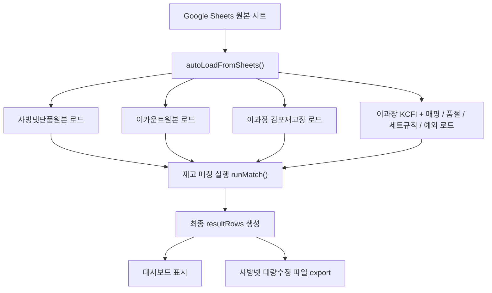

# ASPRO 재고 연동/매칭 운영 설명서

이 문서는 ASPRO 재고 대시보드가 재고 원본을 어디서 가져오고, 어떤 순서로 매칭하며, 어떤 예외 규칙으로 최종 사방넷 가상재고를 만드는지 외부 서비스나 신규 작업자가 처음부터 이해할 수 있도록 정리한 운영 설명서입니다.

## 1. 시스템 목적

ASPRO 재고 대시보드는 사방넷 단품 목록을 기준으로 여러 재고 원천을 합쳐 최종 수정재고를 산출하는 단일 HTML 웹앱입니다.

최종 목적은 다음입니다.

- 사방넷 단품코드별 최종 재고 산출
- 김포 물류 재고 우선 반영
- 이카운트 재고 보조 반영
- KCFI 신원 재고 원본 반영
- 품절관리, 발주서 품절, 강제재고 같은 운영 예외 반영
- 결과를 사방넷 대량수정 파일로 내보내기

주요 파일:

- `aspro_v42.html`: 메인 대시보드와 전체 매칭 로직
- `apps_script_aspro_sync.gs`: Google Sheets 저장/조회용 Apps Script API
- `deploy.sh`: GitHub push와 Apps Script push/deploy 보조 스크립트

## 2. 데이터 저장 위치

데이터 저장소는 Google Sheets입니다.

Spreadsheet ID:

```text
1cl-uZ9s0_VNF_YwagnujAhPTdREuzfcaPisWRRp7zwY
```

앱은 읽기 작업은 주로 Google Sheets CSV 공개 URL로 직접 읽고, 쓰기 작업은 Apps Script Web App으로 저장합니다.

이 구조를 쓰는 이유:

- CSV 읽기: 빠르고 Apps Script 배포 상태에 덜 의존
- Apps Script 쓰기: 브라우저에서 Google Sheets에 안전하게 저장
- localStorage: 네트워크 실패 시 임시 보호/복구

## 3. 주요 시트 역할

| 시트명 | 역할 | 앱 내부 데이터 |
|---|---|---|
| `사방넷단품원본` | 기준 단품 목록. 최종 결과는 이 행들을 기준으로 생성 | `sabData`, `sabRaw` |
| `이카운트원본` | 이카운트 SKU별 재고 원본 | `icMap` |
| `김포재고장` (이과장 통합문서) | 김포 물류 재고 운영 원본 | `gpMap` |
| `KCFI` (이과장 통합문서) | KCFI 신원 재고 운영 원본 | `kcfiMap`, `kcfiMetaMap` |
| `aspro_match` | 사방넷코드 → 김포 물류품번 매핑 저장소 | `matchMap` |
| `aspro_soldout` | 사방넷코드 기준 품절관리 저장소 | `soldoutMap` |
| `aspro_iccodemap` | 사방넷코드/자체코드 → 이카운트 품목코드 직접 지정 | `icCodeMap` |
| `aspro_setmap` | 세트/묶음 상품 구성 규칙 | `setRuleMap` |
| `aspro_forcezero` | 자체코드 또는 사방넷코드 기준 강제품절 | `forceZeroMap` |
| `aspro_forcestock` | 사방넷코드 기준 강제재고 | `forceStockMap` |
| `aspro_soldout_logistics` | 물류품번 기준 영구 품절/발주서 품절 | `soldoutLogisticsMap` |
| `aspro_kcfi` | 파싱 완료된 KCFI 사방넷코드별 재고 백업 | `kcfiMap` |

## 4. 전체 처리 흐름

전체 흐름은 다음과 같습니다.



### 일일 자동 재계산

- 평일 07:00: 이카운트 다건 API 1회로 `이카운트원본` 갱신
- 매일 07:15: `daily-recalculate.mjs`가 이카운트 OAPI 원본과 이과장 통합문서의 `김포재고장`·`KCFI`, 매핑·품절·세트·강제재고 규칙을 다시 계산
- 상품·옵션 합계 대사 통과 시 하나허브 `aspro-calculated-stock` / `aspro-calculated-options` 새 세대로 반영
- 이과장이 해당 탭을 수정하면 다음 07:15 자동 계산에 반영
- 김포·KCFI 날짜가 평일 3일(주말 5일)보다 오래되거나 원본 건수가 급감하면 직전 정상 세대를 유지하고 반영을 중단

앱 시작 또는 `Google Sheets 연동/지금 불러오기` 실행 시:

1. `loadBaseViaCSV()`로 매핑, 품절, KCFI, 강제재고, 세트규칙 등을 불러옵니다.
2. `loadRawViaCSV()`로 사방넷/이카운트와 이과장 `김포재고장` 원본을 불러옵니다.
3. `loadKCFIFromSheetRaw()`로 이과장 `KCFI` 탭을 파싱합니다.
4. 사용자가 `재고 매칭 실행`을 누르면 `runMatch()`가 최종 재고를 산출합니다.

## 5. 사방넷단품원본 처리

사방넷 단품원본은 최종 결과의 기준입니다.

주요 필드:

- 사방넷코드
- 상품명
- 옵션
- 자체코드
- 현재 가상재고
- 원본 row 전체

앱은 사방넷의 각 단품 행을 하나씩 돌면서 최종 재고를 계산합니다. 어떤 재고 원천에도 매칭되지 않으면 `매핑없음`으로 분류됩니다.

## 6. 김포원본 처리

김포원본은 실제 물류 출고 기준이므로, 이카운트와 동시에 잡히는 경우 김포 재고가 우선입니다.

### 6.1 컬럼 구조

현재 김포원본은 다음 형태를 지원합니다.

```text
1행: 날짜
2행: 헤더
A열: 판매 상태
C열: 품목코드
```

예:

```text
판매 종료 / 1101240158 / JW261GW01-GN-55 / 상품명 / ... / 수량
```

김포 파서는 컬럼 번호를 고정하지 않고 행 앞쪽에서 실제 물류품번 패턴을 찾습니다.

관련 함수:

- `findGimpoHeaderInfo()`
- `findSaleStatusIdx()`
- `isGimpoRowActive()`
- `parseGimpoStockRow()`

### 6.2 판매상태 필터

판매상태 컬럼명은 띄어쓰기 차이를 허용합니다.

인식 가능한 헤더 예:

- `판매상태`
- `판매 상태`
- `판매여부`
- `판매상태값`

다음 상태는 재고에서 제외합니다.

- `판매중지`
- `판매 종료`
- `판매종료`
- `종료`
- `단종`
- `중지`
- `STOP`
- `N`
- `비활성`
- `INACTIVE`
- `판매불가`

### 6.3 품번/수량 파싱

물류품번은 다음과 같은 패턴으로 감지합니다.

```text
JW261GW01-GN-55
252MX05-BU-55
252JW10-IV-44
```

수량은 물류품번 오른쪽의 숫자 컬럼 중 마지막 유효 숫자를 사용합니다.

### 6.4 김포 세트 자동 계산

김포에 `-CD`, `-SK` 같은 구성품이 있으면 일부 세트 품번은 자동 계산됩니다.

또한 `aspro_setmap`의 규칙으로 2종/3종 구성 세트 상품을 계산합니다.

예:

```text
사방넷 옵션: 플럼+베이지:55
세트 규칙: MS25S → 252MX05
구성품: 252MX05-BU-55 + 252MX05-BE-55
최종 재고: 두 구성품 재고 중 최소값
```

같은 색상을 2개 쓰는 경우:

```text
플럼+플럼:55
최종 재고 = floor(252MX05-BU-55 재고 / 2)
```

## 7. 이카운트원본 처리

이카운트원본은 이카운트 품목코드와 재고를 기준으로 `icMap`을 만듭니다.

이카운트 매칭 방식:

1. `aspro_iccodemap` 직접 매핑
2. 자체코드/prefix 기반 매칭
3. 상품명 정규화 기반 이름 매칭
4. 색상/사이즈 옵션 비교

이카운트는 보조 재고입니다. 김포와 이카운트가 동시에 잡히면 김포를 우선합니다.

## 8. KCFI 신원 재고 처리

KCFI는 두 방식으로 처리됩니다.

1. 파일 업로드
2. 이과장 통합문서의 `KCFI` 탭 직접 연동

현재 운영 기준은 이과장 통합문서의 `KCFI` 탭을 매일 직접 읽는 방식입니다. 숫자·문자 사이즈가 섞인 열을 GViz로 읽으면 `S/M/L`이 누락되므로 Google Sheets 원본 CSV export를 사용합니다.

### 8.1 KCFI 원본 구조

KCFI 원본은 상품 단위 블록입니다.

```text
상품명
이미지 / 색상 / 사이즈 / 실수량 / 비고
색상 / 사이즈 / 수량
색상 / 사이즈 / 수량
TTL / 합계
다음 상품명
```

데이터 행 A열이 비어 있어도 상단 상품명에 귀속됩니다.

예:

```text
25SS 후라밍고 크로셰 풀오버 3종+나시탑1종
이미지 / 색상 / 사이즈 / 실수량 / 비고
네이비(공통) / 55 / 931
네이비(공통) / 66 / 1,366
TTL / 15,148
```

앱은 이 데이터를 다음처럼 해석합니다.

```text
상품명 = 25SS 후라밍고 크로셰 풀오버 3종+나시탑1종
옵션 = 네이비:55
재고 = 931
```

### 8.2 KCFI 헤더 자동 추론

Google Sheets CSV로 읽으면 화면상 `사이즈/실수량`이 보이더라도 CSV 값이 빈칸으로 내려올 수 있습니다.

그래서 앱은 `이미지/색상`만 있어도 다음처럼 추론합니다.

```text
색상 = B열
사이즈 = C열
수량 = D열
```

인식 가능한 수량 헤더:

- `전산수량`
- `실수량`
- `수량`

### 8.3 KCFI 상품명 매핑

KCFI 물류 상품명과 사방넷 상품명이 다를 수 있습니다.

예:

```text
KCFI 물류상품명: [H.Cashmere] 캐시미어 블렌딩 후드 니트
사방넷 상품명: 블렌딩 후드 니트
```

이 차이는 상품명 → 사방넷 prefix 매핑으로 해결합니다.

매핑 출처:

- `KCFI_PRODUCT_MAP`: 코드 내부 기본 매핑
- `kcfiProductMapExtra`: 화면에서 직접 저장한 추가 매핑
- 자동추정: 상품명 키워드 기반 후보가 명확할 때

KCFI 행에는 다음 메타가 붙습니다.

- 물류상품명
- KCFI 옵션
- 사방넷 prefix
- 매칭방식: `수동맵`, `직접맵`, `자동추정`

### 8.4 KCFI 옵션 정규화

색상 괄호는 제거합니다.

```text
블랙(공통) → 블랙
아이보리(나시) → 아이보리
```

일부 색상 표기 차이도 보정합니다.

```text
블루 ↔ 틸블루 / 스카이블루 / 라이트블루
화이트 ↔ 아이보리 / 크림
그레이 ↔ 라이트그레이 / 차콜
```

## 9. 매핑 저장소

### 9.1 aspro_match

사방넷코드와 김포 물류품번을 저장합니다.

```text
사방넷코드 / 김포물류품번 / 상품명 / 메모 / 등록일
```

앱 내부에서는 `matchMap`으로 로드합니다.

### 9.2 extraMap

브라우저에서 사용자가 새로 입력하거나 수정한 매핑은 `extraMap`에 먼저 저장됩니다.

저장 시:

```text
최종 저장 map = matchMap + extraMap
```

`extraMap`이 `matchMap`을 덮어씁니다.

### 9.3 매핑없음 처리

어떤 재고 원천에도 연결되지 않은 사방넷 단품은 `매핑없음` 탭에 표시됩니다.

사용자는 여기서 직접 김포 물류품번을 입력할 수 있습니다. 저장하면 다음 매칭부터 반영됩니다.

## 10. 최종 재고 우선순위

`runMatch()`에서 각 사방넷 단품별 최종 재고를 결정합니다.

현재 우선순위는 다음입니다.

1. `aspro_forcezero`: 강제품절
2. `aspro_forcestock`: 강제재고
3. KCFI 재고가 있고 0보다 큰 경우
4. 김포 재고
5. 이카운트 재고
6. KCFI 재고가 0인 경우
7. `aspro_soldout`: 품절관리
8. 아무것도 없으면 매핑없음

중요한 운영 기준:

- 김포와 이카운트가 동시에 있으면 김포 우선
- KCFI 재고가 양수이면 KCFI 우선
- 강제품절은 모든 재고보다 우선해서 0 처리
- 강제재고는 리오더 신상품처럼 물류 재고와 무관하게 지정 수량을 사용

## 11. 품절관리

### 11.1 사방넷코드 기준 품절

`aspro_soldout`은 사방넷코드 기준 품절 저장소입니다.

품절 처리 시:

1. localStorage에 즉시 저장
2. Apps Script로 `aspro_soldout`에 백업
3. 새로고침/소스 수정 후에도 Google Sheets에서 복원
4. 품절처리된 항목은 매핑없음에서 제외

### 11.2 물류품번 기준 영구 품절

`aspro_soldout_logistics`는 물류품번 기준 영구 품절/발주서 품절입니다.

최종 산출된 물류품번이 이 목록에 있으면 재고가 0으로 바뀌고 소스가 `발주서품절`로 표시됩니다.

단, `강제재고`는 발주서품절보다 우선합니다.

## 12. 강제품절과 강제재고

### 12.1 강제품절

`aspro_forcezero`는 자체코드 prefix 또는 사방넷코드 기준으로 무조건 재고 0 처리합니다.

사용 예:

- 운영상 판매를 막아야 하는 상품
- 재고 원천에는 남아 있지만 실제 판매하면 안 되는 상품

### 12.2 강제재고

`aspro_forcestock`은 사방넷코드 기준으로 고정 재고를 넣습니다.

사용 예:

- 리오더 신상품
- 아직 물류/이카운트에 재고가 정상 반영되지 않았지만 판매 가능 수량을 임시로 넣어야 하는 경우

## 13. 물류품번 변경 대응

물류 품번이 변경된 경우 앱에서 자동 변환합니다.

현재 적용 예:

```text
252MX18-001  → 252MX18CD-001
252MX18-016  → 252MX18CD-016
```

적용 범위:

- 재고 매칭
- 매핑 마스터 표시
- 인라인 저장
- 매핑없음 저장
- Google Sheets 저장
- 엑셀 내보내기

즉 기존 매핑에 구품번이 남아 있어도 다음 저장 시 신품번으로 정규화됩니다.

## 14. 최종 결과와 내보내기

매칭 실행 후 `resultRows`에 최종 결과가 저장됩니다.

각 결과 행의 주요 내부 필드:

- `_qty`: 최종 재고
- `_src`: 최종 재고 출처
- `_status`: `matched`, `zero`, `unmatched`
- `_물류품번`: 최종 연결 품번
- `_kcfiProduct`: KCFI 물류상품명
- `_kcfiOpt`: KCFI 옵션
- `_kcfiMethod`: KCFI 매칭방식
- `_gpAudit`: 김포 후보 감사 정보

내보내기 시 사방넷 원본 row를 유지하면서 재고 관련 컬럼만 수정합니다.

일반적으로:

- 최종 재고가 0보다 크면 판매 가능 재고로 반영
- 최종 재고가 0이면 품절/판매불가 상태로 반영
- 안전재고 설정이 있으면 일정 비율 또는 조건에 따라 재고를 줄여 내보냄

## 15. 저장 방식

### 15.1 읽기

읽기는 기본적으로 CSV 직접 조회입니다.

```text
https://docs.google.com/spreadsheets/d/{SHEET_ID}/gviz/tq?tqx=out:csv&sheet={sheetName}
```

장점:

- 빠름
- Apps Script 배포 장애에 덜 민감

### 15.2 쓰기

쓰기는 Apps Script Web App으로 POST합니다.

저장 대상:

- `aspro_match`
- `aspro_soldout`
- `aspro_kcfi`
- `aspro_iccodemap`
- 기타 운영 예외 시트

앱은 쓰기 전에 로컬 데이터가 너무 적으면 저장 경고를 띄워 Google Sheets 데이터 유실을 막습니다.

## 16. 외부 서비스가 연동할 때 주의할 점

외부 서비스가 이 프로젝트와 연동하거나 재구현할 때 반드시 지켜야 하는 기준입니다.

1. 기준 행은 항상 `사방넷단품원본`입니다.
2. 김포와 이카운트가 동시에 있으면 김포 우선입니다.
3. `김포원본`의 A열 판매상태는 반드시 반영해야 합니다.
4. `판매 종료` 등 비활성 상태는 재고에서 제외해야 합니다.
5. KCFI 원본은 상품명 블록 단위로 해석해야 합니다.
6. KCFI 데이터 행의 빈 A열은 상단 상품명에 귀속해야 합니다.
7. KCFI 수량 헤더가 CSV에서 비어도 `이미지/색상` 구조로 컬럼을 추론해야 합니다.
8. 품절관리와 강제재고는 단순 매핑보다 우선순위가 높습니다.
9. 세트 상품은 물류에 단일 SKU가 없을 수 있으므로 구성품 최소 재고로 계산해야 합니다.
10. 매핑 저장 시 기존 Google Sheets 데이터가 줄어들지 않도록 안전장치가 필요합니다.

## 17. 문제 발생 시 확인 순서

재고가 이상할 때는 아래 순서로 확인합니다.

1. `사방넷단품원본`에 해당 사방넷코드가 있는지 확인
2. `aspro_forcezero` 또는 `aspro_forcestock`에 예외가 있는지 확인
3. `aspro_soldout` 또는 `aspro_soldout_logistics`에 품절 등록 여부 확인
4. KCFI 상품이면 `kcfi_원본`의 상품명 블록과 색상/사이즈 확인
5. 김포 기준 상품이면 `김포원본`에서 판매상태가 활성인지 확인
6. `aspro_match`에 사방넷코드 → 김포 물류품번 매핑이 있는지 확인
7. 세트 상품이면 `aspro_setmap`의 prefix와 색상코드 매핑 확인
8. 이카운트 상품이면 `이카운트원본`과 `aspro_iccodemap` 확인
9. 앱 로그 탭에서 `gpMap 없음`, `KCFI_PRODUCT_MAP 누락`, `세트규칙 없음` 경고 확인

## 18. 개발/배포 메모

작업 흐름:

```bash
git pull
# 수정
./deploy.sh
```

`deploy.sh`는 GitHub push와 Apps Script push/deploy를 통합합니다.

주의:

- `.clasp.json`, `.env`, 토큰은 커밋 금지
- Apps Script 수정 후에는 `clasp push --force`만으로 끝내지 말고 배포본 갱신 여부 확인
- `aspro_v42.html`은 단일 파일이므로 전체 재작성보다 함수 단위 수정 권장

## 19. 한 줄 요약

ASPRO 재고 대시보드는 사방넷 단품을 기준으로 KCFI, 김포, 이카운트, 품절/강제 예외, 세트규칙을 순서대로 적용해 최종 판매 가능 재고를 산출하고, 그 결과를 사방넷 대량수정 파일로 내보내는 운영 도구입니다.
